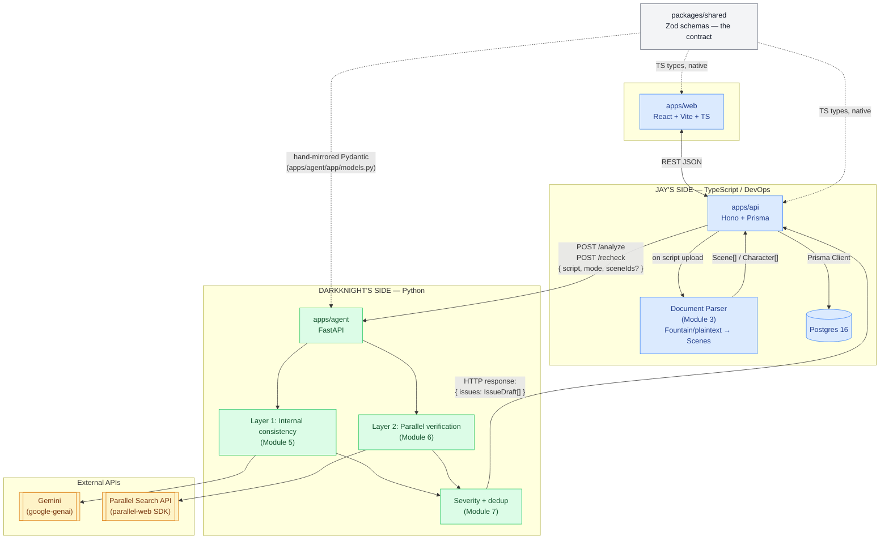

# Ross — Architecture & Team Split

Two people, one repo, one boundary: **the agent never touches Postgres.** Everything
else follows from that one rule.

- **Jay** — TypeScript + DevOps: `apps/web`, `apps/api`, the document parser, Prisma/Postgres,
  Docker Compose, CI/deploy.
- **Darkknight** — Python: `apps/agent` only. Continuity reasoning (Layer 1), Parallel
  Search verification (Layer 2), severity/dedup, all LLM prompting.

If you're not sure who owns a piece of code, ask: *does this touch the database or
infra?* → Jay. *Does this touch Gemini, Parallel, or an LLM prompt?* → Darkknight.

---

## 1. System diagram



Legend: blue = Jay's side, green = Darkknight's side, grey = the shared contract
both read from, yellow = third-party APIs the agent calls directly.

---

## 2. Who owns what

| Component | Owner | Notes |
|---|---|---|
| `apps/web` | Jay | React/Vite UI |
| `apps/api` | Jay | Hono routes, Prisma, job orchestration |
| Document parser (Module 3) | Jay | TS, lives in `apps/api` or a new `packages/parser` |
| `docker-compose.yml`, Dockerfiles, `.env.example`, Makefile | Jay | Darkknight touches `apps/agent/Dockerfile` only when Python deps change |
| `apps/agent` (FastAPI shell, routing, tool wiring) | Darkknight | |
| Layer 1 — internal consistency (Module 5) | Darkknight | Prompting, Gemini calls |
| Layer 2 — external verification (Module 6) | Darkknight | Parallel Search integration |
| Severity + dedup (Module 7) | Darkknight | Runs agent-side, before the HTTP response leaves `apps/agent` |
| Incremental re-check (Module 8) | **Split** | Scene-hash diffing lives in `apps/api` (Jay); honoring `mode: "partial"` + `sceneIds` in prompting lives in `apps/agent` (Darkknight) |
| `packages/shared` (Zod schemas) | Jay (source of truth) | Darkknight must be notified of any change — see §4 |
| `apps/agent/app/models.py` (Pydantic mirror) | Darkknight | Manually kept in sync with `packages/shared`, same pattern as Module 1 |

---

## 3. The interface contract

This is the one thing that must be agreed on **before** Jay and Darkknight split
off and work independently. Everything below is a proposed contract — adjust
together, then treat it as frozen until you deliberately version it.

### 3.1 API → Agent: `POST /analyze` and `POST /recheck`

The API calls the agent synchronously over the internal Docker network
(`http://agent:8000`, service name from `docker-compose.yml`). The agent does all
its Gemini/Parallel work inside that single request and returns the finished,
ranked, de-duped issue list — no callback, no webhook, no polling between the two
services. (The `AnalysisJob` polling that `GET /jobs/:id` exposes to the *frontend*
is a separate concern — the API owns updating job status while it waits on this
one blocking call to the agent.)

**Request body** (`AnalyzeAgentRequest` — add to `packages/shared`):

```ts
{
  scriptId: string;
  mode: "full" | "partial";
  sceneIds?: string[];       // present + non-empty when mode === "partial"
  script: Script;            // full Script from @ross/shared, scenes[] populated by the parser
}
```

The agent always receives the **entire** `Script` object (full text + all scenes),
even on a partial recheck — `mode`/`sceneIds` are instructions about which scenes
to focus new analysis on, not a payload restriction. Internal continuity checks
need the whole script in context to catch cross-scene contradictions.

**Response body** (`AnalyzeAgentResponse` — add to `packages/shared`):

```ts
{
  issues: IssueDraft[];
}
```

`IssueDraft` is `Issue` minus the fields only the database can assign:

```ts
// Issue minus: id, status, createdAt, updatedAt, resolvedAt,
//              dismissedReason, recheckCount, lastRecheckAt
type IssueDraft = {
  type: IssueType;
  severity: Severity;
  confidence: number;
  title: string;
  description: string;
  evidence: string;
  sceneIds: string[];
  characterIds: string[];
  entityName: string | null;
  sources: Source[];
  sourceConflict: SourceConflict | null;
};
```

The API inserts each `IssueDraft` as a new `Issue` row with `status: "open"`,
a generated `id`, and `scriptId`/timestamps filled in — this is why the agent
never needs write access to Postgres.

**Error contract:** on failure the agent returns a non-2xx status with
`{ "error": string }`. The API catches this, sets the `AnalysisJob.status` to
`"failed"` with `error` populated, and does **not** retry automatically.

**Timeout:** agree on a number before Module 4 — a full-script Gemini pass plus
several Parallel calls can run long. Suggested starting point: 120s on the API's
HTTP client, with the agent itself logging a warning past 60s. Revisit once
Darkknight has timed a real run.

### 3.2 Environment variables — who needs what

| Variable | Needed by | Owner |
|---|---|---|
| `DATABASE_URL`, `POSTGRES_USER/PASSWORD/DB` | `apps/api` only | Jay |
| `GOOGLE_API_KEY` | `apps/agent` only | Darkknight |
| `PARALLEL_API_KEY` | `apps/agent` only | Darkknight |
| `AGENT_URL` (`http://agent:8000` in Compose, `http://localhost:8000` for bare local run) | `apps/api`, to know where to call | Jay wires it, but the port is Darkknight's to change if agent's port changes |
| `API_URL`, `VITE_API_URL` | `apps/web` | Jay |

Darkknight never receives `DATABASE_URL` and should never add a Postgres client
to `apps/agent` — that's the boundary rule made concrete. If Layer 1/2 ever seem
to need to "look something up," the answer is: pass more of the `Script`/`Scene`
payload in the `/analyze` request, don't add a DB call.

### 3.3 The shared-schema workflow

`packages/shared` is TypeScript-first (Zod). Whenever it changes:

1. Jay edits `packages/shared/src/*.ts`, runs `pnpm --filter @ross/shared build`.
2. Jay (or Darkknight, if the change originated on the Python side — e.g. a new
   field Layer 1 needs to emit) hand-mirrors the change into
   `apps/agent/app/models.py` — same field names translated to `snake_case` with
   a matching `alias=` for the camelCase JSON, same pattern already used for
   `Issue`/`Script`/`Scene`.
3. Flag the change to the other person before merging — there is no CI check
   enforcing drift yet (see Module 10 risk register: "TS/Python schema drift").

---

## 4. What Jay needs from Darkknight

- Confirmation of the `/analyze` and `/recheck` request/response shapes above
  before Jay wires the real call in Module 4 (currently calling a stub).
- A realistic timeout number once Darkknight has timed a full Gemini pass +
  Parallel calls on the seed script.
- Any new fields Layer 1/2 need on `Issue` (e.g. a new `IssueType`) — added to
  `packages/shared` together, not silently invented on the Python side.
- `apps/agent/requirements.txt` kept current so Jay's Dockerfile/CI don't break.

## 5. What Darkknight needs from Jay

- The parsed `Script` shape (Module 3) — scenes populated with `heading`,
  `location`, `timeOfDay`, `lines[]`, `characterIds[]` — since Layer 1 reasons
  over this structure, not raw text.
- The `AGENT_URL` / networking setup (already in `docker-compose.yml` — agent is
  reachable at `http://agent:8000` from `api`, and `http://localhost:8000` from
  a host machine).
- A running Postgres + API to point a browser/curl at to see issues actually
  land (`GET /scripts/:id/issues`) — Darkknight needs zero DB credentials to
  verify this, just the API's HTTP surface.
- A heads-up whenever `packages/shared` changes, per §3.3.

---

## 6. Reference docs

- **Parallel Search API** — hackathon resource bundle (API keys, quickstart):
  https://agentic-cinema.devpost.com/details/parallel-resources
- **Parallel SDK (`parallel-web` on PyPI)**: https://pypi.org/project/parallel-web/
- **Parallel docs**: https://docs.parallel.ai/
- **Google `google-genai` SDK**: https://ai.google.dev/gemini-api/docs
- **Prisma docs** (Jay): https://www.prisma.io/docs
- **Hono docs** (Jay): https://hono.dev/docs
- **FastAPI docs** (Darkknight): https://fastapi.tiangolo.com/
- Existing hard-gate smoke scripts prove both third-party APIs are reachable
  before building on top of them: `scripts/smoke-parallel.py`,
  `scripts/smoke-gemini.py`, run via `make smoke`.

See `docs/MODULES.md` for a deep breakdown of every remaining module with an
owner tag on each subtask.
